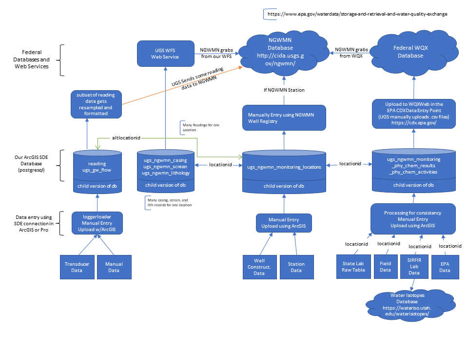

# NGWMN
Scripts and files used to help manage data for the [National Groundwater Monitoring Network](https://cida.usgs.gov/ngwmn/)
* If you can't find data or a station or see a bad site location, please submit a descriptive issue

## Data Sources
* The UGS NGWMN Project compiles data from three different data sources: field data, state lab data, and EPA data.
* These sources are connected to each other by a monitoring location id.  If this id is not present or messed up, connecting the data is a pain in the butt.

### Field Data
* Field data entry should be done on the Google Sheet `FieldDataEntry` in the shared drive under `Projects\NGWMN\Field_Data_and_Field_Sheets`
* Field data are also occasional captured using the ESRI Collector App.

### State Lab Data
* State Lab data is received as raw text files downloaded from the State Lab Keith Henderson (khenderson@utah.gov) at the State Lab.
* Raw text files are kept in the directory `Projects\NGWMN\Chemistry_Results_Data\StateLab\`
* An [example file](https://github.com/utah-geological-survey/NGWMN/blob/main/examples/UTGS_EDD_20200728.txt) has been included in this repository

### EPA Data
* These data are sent as spreadsheets from the EPA lab in Denver
* All bottles collected by the UGS and sent to the EPA are tracked using COCs, stored in the shared drive under `Projects\NGWMN\COCs_lab_forms` and sorted by year
* An example file has been included in this repository

## Data Archives
* Data are stored in the UGS SDE, then submitted to the EPA WQX using the [CDX portal](https://cdx.epa.gov/)
* The [USGS NGWMN Portal](https://cida.usgs.gov/ngwmn/) hosts the EPA WQX data
* Site data are stored in the UGS SDE, and submitted and updated on the [NGWMN Portal](https://cida.usgs.gov/ngwmn/)
* The UGS SDE schema tries to emulate that of the EPA WQX, based on Stations, Results, and Activities.

### Stations
* Site locations and metadata are entered through the [NGWMN Location Registry](https://www.usgs.gov/apps/location-registry/)
* Stations are saved in the UGS SDE in the table `ugs_ngwmn_monitoring_locations`
* Stations are connected to Activities based on the `monitoringlocationid`

### Results
* Results are the reports measuements of water properties; most often the concentrations of ions measured in water
* Each measure has a row in the results table (ex. the measure of Magnesium in a sample has its own row).
* Results are saved in the UGS SDE in the table `ugs_ngwmn_monitoring_phy_chem_results`

### Activities
* An activity represents the filling of bottles or measuring of field parameters
* Each activity is typically joined with multiple rows in the `Results`
* Activities are connected to results through an `activityid`
* If I visit a well in the field and collect a water sample and collect field measurments, 
  * the water sample has an activity id and the field measurements have a separate activity id
  * the UGS standard is to append a `-FM` suffix on a sample acitivity id for field measures that go with a sample
  * ex. the sample has `activityid` 1505011-18, then the `activityid` of the field measurements with that sample would be 1505011-18-FM
  * This follows how the EPA treats its sample data
* Activities are saved in the UGS SDE in the table `ugs_ngwmn_monitoring_phy_chem_activities`

